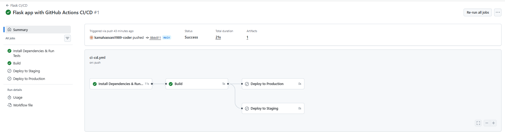
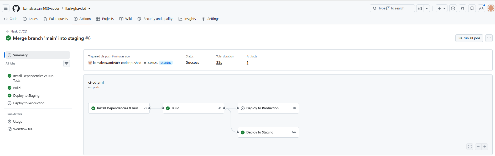
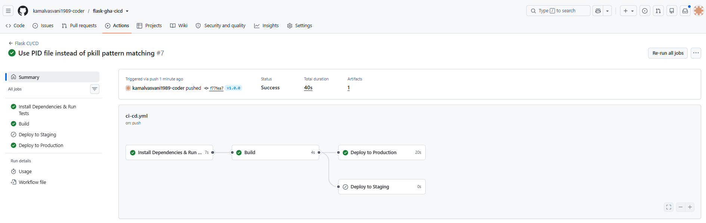
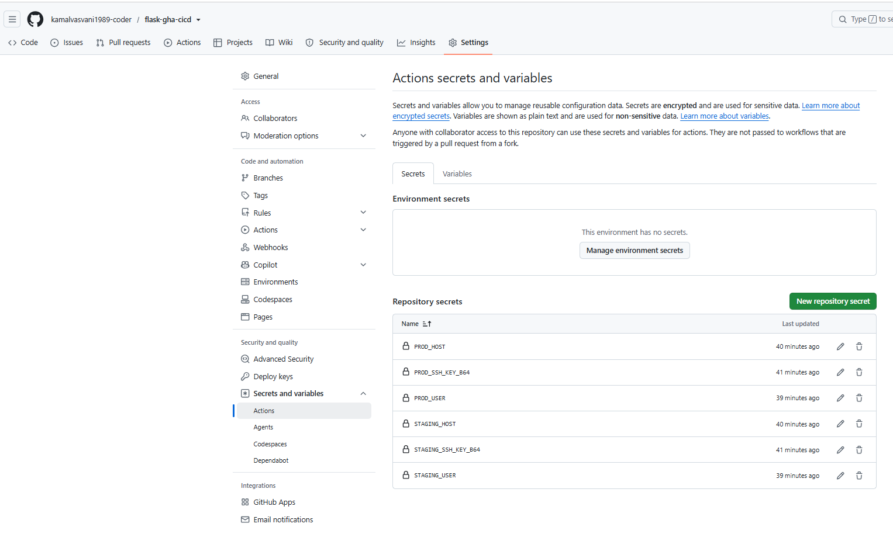
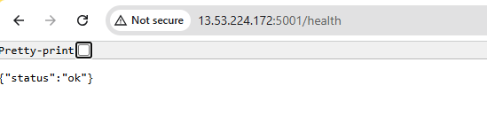
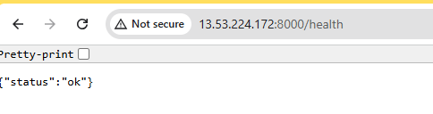

# GitHub Actions CI/CD Pipeline for a Flask Application

This repository contains a simple Flask web application and a GitHub Actions
workflow (`.github/workflows/ci-cd.yml`) that installs dependencies, runs
tests, builds the app, and deploys it to staging and production environments.

## Application

| File | Purpose |
|------|---------|
| `app.py` | Minimal Flask app with `/` and `/health` endpoints |
| `test_app.py` | Unit tests (pytest) |
| `requirements.txt` | Python dependencies (Flask, pytest, gunicorn) |
| `.github/workflows/ci-cd.yml` | The CI/CD workflow |

Run locally:

```bash
python3 -m venv venv && source venv/bin/activate
pip install -r requirements.txt
pytest -v
python app.py   # http://localhost:5000
```

## How the Workflow Works

Triggers:

* **push to `main`** → Install Dependencies → Run Tests → Build (CI only)
* **push to `staging`** → same, then **Deploy to Staging**
* **push a tag matching `v*`** (e.g. `v1.0.0`) → same, then **Deploy to Production**
* pull requests into `main` → tests only

Job graph:

```
test ──► build ──► deploy-staging      (only on the staging branch)
              └──► deploy-production   (only on v* release tags)
```

1. **Install Dependencies & Run Tests** – sets up Python 3.12 with pip
   caching, installs `requirements.txt`, runs `pytest`.
2. **Build** – runs only if tests pass; packages the app as
   `flask-app.tar.gz` and uploads it as a workflow artifact.
3. **Deploy to Staging** – downloads the artifact, copies it to the staging
   server over SSH, installs it into `~/flask-staging`, starts gunicorn on
   **port 5001**, and smoke-tests `http://localhost:5001/health`.
4. **Deploy to Production** – same flow to `~/flask-production` on
   **port 8000**, gated on a `v*` release tag.

Both deploy jobs use GitHub **environments** (`staging`, `production`), so
required reviewers/approvals can be added later if desired.

## Branch Setup

The repository must have a `main` and a `staging` branch:

```bash
git checkout -b staging
git push -u origin staging
```

## Server Prerequisites (staging/production target)

An Ubuntu server reachable on port 22 from GitHub's runners, with:

```bash
sudo apt update && sudo apt install -y python3 python3-venv python3-pip curl
```

Generate a dedicated deploy key **on the server** and authorize it:

```bash
ssh-keygen -t ed25519 -f ~/deploy_key -N ""
cat ~/deploy_key.pub >> ~/.ssh/authorized_keys
chmod 600 ~/.ssh/authorized_keys
# verify before going further - must print KEY-OK:
ssh -i ~/deploy_key -o StrictHostKeyChecking=no ubuntu@localhost 'echo KEY-OK'
```

Open inbound ports in the server's firewall / security group: **22** (from
GitHub runners), **5001** and **8000** (from wherever you verify deployments).

## Configuring Secrets

The private key is stored **base64-encoded as a single line**, which makes it
immune to line-ending and line-wrapping corruption when pasting:

```bash
base64 -w0 ~/deploy_key ; echo
```

Copy the single long line it prints (no BEGIN/END headers - just one line of
base64). Then create these secrets under
**Settings → Secrets and variables → Actions → New repository secret**:

| Secret | Value |
|--------|-------|
| `STAGING_SSH_KEY_B64` | the base64 line from above |
| `STAGING_HOST` | staging server IP or hostname |
| `STAGING_USER` | SSH username (e.g. `ubuntu`) |
| `PROD_SSH_KEY_B64` | base64 deploy key for production |
| `PROD_HOST` | production server IP or hostname |
| `PROD_USER` | SSH username (e.g. `ubuntu`) |

Staging and production may point at the same test server (different ports).
The workflow decodes the key at run time (`base64 -d`) and validates it with
`ssh-keygen -y` before attempting to connect, so a corrupted secret fails
fast with a clear error message instead of a cryptic SSH failure.

Secrets are encrypted by GitHub, never printed in logs, and only exposed to
the jobs that reference them.

## Triggering the Pipeline

```bash
# CI on main
git push origin main

# Deploy to staging
git checkout staging && git merge main && git push origin staging

# Deploy to production
git tag v1.0.0 && git push origin v1.0.0
```

Verify deployments:

```bash
curl http://<SERVER_IP>:5001/health   # staging  -> {"status":"ok"}
curl http://<SERVER_IP>:8000/health   # production -> {"status":"ok"}
```

## Screenshots (Submission Evidence)

### CI run on `main` (tests + build; deploys skipped by design)


### Staging deployment run (`staging` branch)


### Production deployment run (release tag)


### Configured secrets (names only; values are hidden by GitHub)


### Deployment verification



